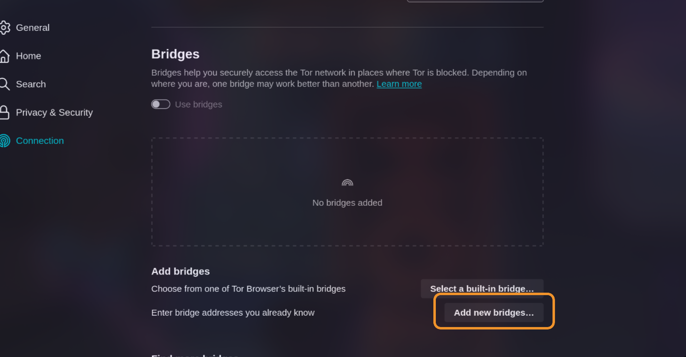
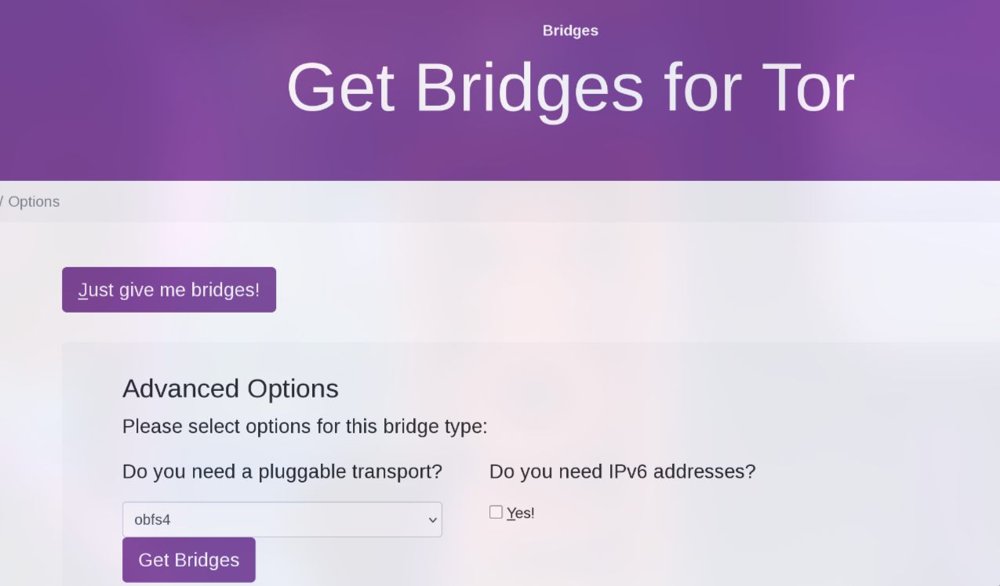

# BRIDGES en Tor

Los **bridges** (o *puentes*) son relés de Tor operados por voluntarios que funcionan de forma parecida a los relés normales, pero con una diferencia clave: **no aparecen publicados en listados públicos**. Esto dificulta que un censor o firewall los bloquee simplemente “leyendo una lista”.
Los bridges sirven para:

- **Ocultar mejor que estás usando Tor**.
- **Evitar bloqueos** donde Tor está censurado.

Ten en cuenta que usar bridges puede **reducir la velocidad** o aumentar la latencia comparado con conectarse a Tor “normalmente”.

## ¿Cuándo conviene usar bridges?

Usa bridges si:

- Tor está bloqueado en tu red/país.
- La conexión a Tor se corta o no llega a establecerse.
- Quieres hacer más difícil la detección de tráfico Tor.

Si Tor conecta sin problemas, normalmente no necesitas bridges.

---

## Cómo obtener direcciones de bridges

Como los bridges no se publican de forma abierta, hay que **solicitarlos**. Las opciones más comunes son:

### 1) Pedir bridges desde Tor Browser

**Si es tu primera vez abriendo Tor Browser (Escritorio):**

1. Abre Tor Browser.
2. En la pantalla inicial, entra en **Configurar conexión**.
3. Ve a la sección **Bridges/Puentes**.
4. Busca la opción para **encontrar más bridges** y elige **solicitar bridges**.
5. Completa el captcha si aparece y envía.
6. Pulsa **Conectar**.

**Si Tor Browser ya está abierto (Escritorio):**

1. Abre el menú (≡).
2. Entra a **Ajustes/Settings**.
3. Ve a **Conexión/Connection**.
4. En la sección **Bridges/Puentes**, usa la opción de **solicitar bridges**.
5. Completa el captcha si aparece. Los cambios suelen guardarse automáticamente al cerrar la pestaña.

### 2) Conseguir bridges en la web (torproject.org)

Puedes obtener líneas de bridge desde el sitio de bridges del Proyecto Tor. 

https://bridges.torproject.org/options

Luego solo tienes que **copiar las líneas de bridge** que te entrega la web.

### 3) Obtener bridges por correo

Puedes solicitar bridges enviando un email a:

- `bridges@torproject.org`

 En la respuesta recibirás líneas de bridges para copiar y pegar.

### 4) Obtener bridges por Telegram

1. Abre Telegram y busca el bot **@GetBridgesBot**.
2. Pulsa **Start** o escribe `/start`.
3. Pide bridges según el transporte que necesites, por ejemplo:
	- `/obfs4`
	- `/webtunnel`
4. Copia las líneas de bridge que te devuelve el bot.

---

## Cómo introducir (configurar) direcciones de bridges

### Tor Browser en escritorio (Linux/Windows/macOS)

**Si es la primera vez que inicias Tor Browser:**

1. Abre Tor Browser.
2. Entra en **Configurar conexión**.
3. En **Bridges/Puentes**, selecciona la opción de **introducir bridges que ya conoces**.
4. Pulsa **Añadir bridges nuevos**.
5. Pega o escribe **una dirección por línea**.
6. Pulsa **Conectar**.

**Si Tor Browser ya está abierto:**

1. Menú (≡) → **Settings/Ajustes** → **Connection/Conexión**.
2. En **Bridges/Puentes**, elige **introducir bridges que ya conoces**.
3. **Añadir** y pega **una línea por bridge**.
4. Cierra la pestaña; normalmente se guarda automáticamente.

### Tor Browser para Android

1. Abre Tor Browser.
2. Entra en **Settings/Ajustes** (⚙️).
3. Baja a la sección **Connection/Conexión**.
4. Entra en la configuración de **Bridge/Puente**.
5. Activa **Use a Bridge / Usar un puente**.
6. Elige **Provide a bridge I know / Proporcionar un bridge que conozco**.
7. Pega la dirección del bridge.

---

## Solución de problemas

Si la conexión falla:

- Es posible que el bridge esté **caído** o haya sido **bloqueado**.
- Solicita **bridges nuevos** por alguno de los métodos anteriores.
- Prueba otro transporte (si tu entorno lo requiere), por ejemplo obfs4 o webtunnel.

---

## Compartir bridges (copia y QR)

Dependiendo del sistema, los bridges pueden compartirse:

- Copiando la **línea completa** del bridge.
- Mediante un **código QR** (si la interfaz lo ofrece), útil para pasar el bridge a un móvil.

