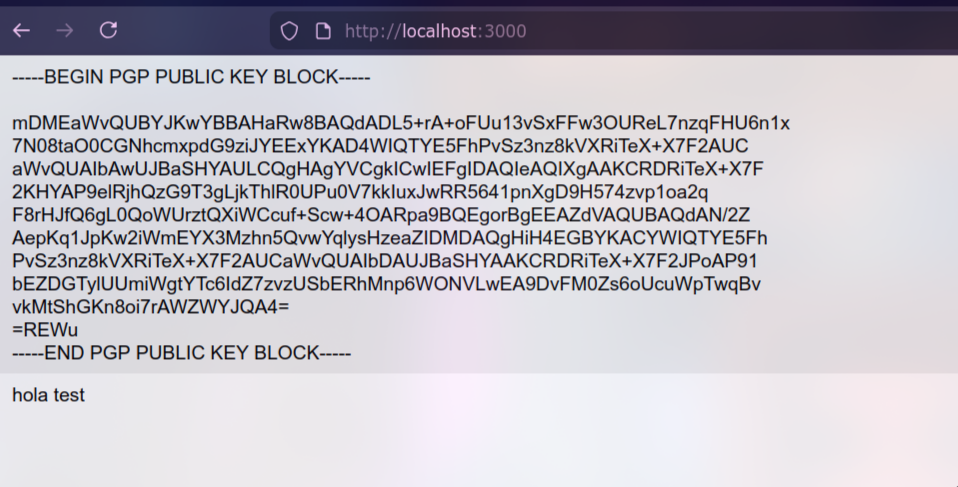
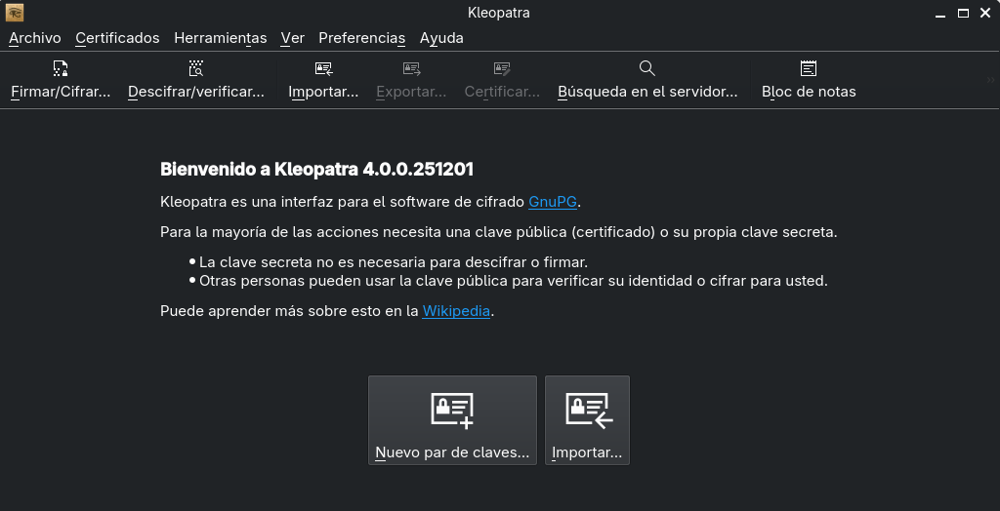
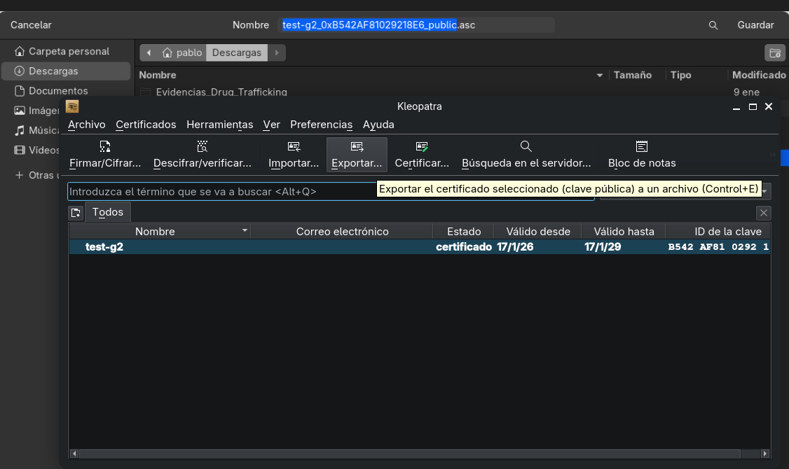
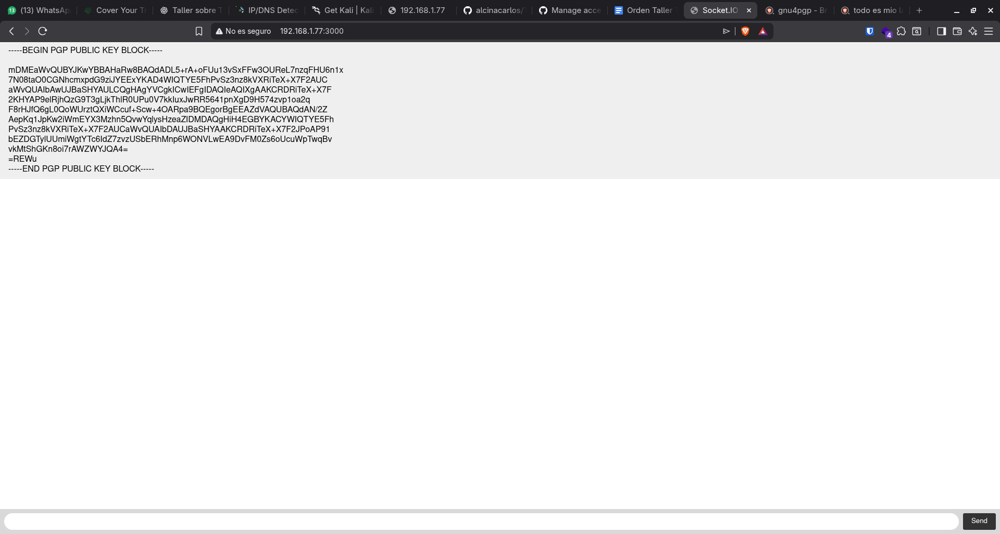
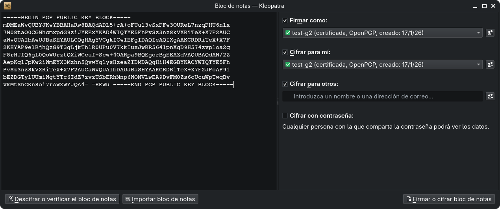
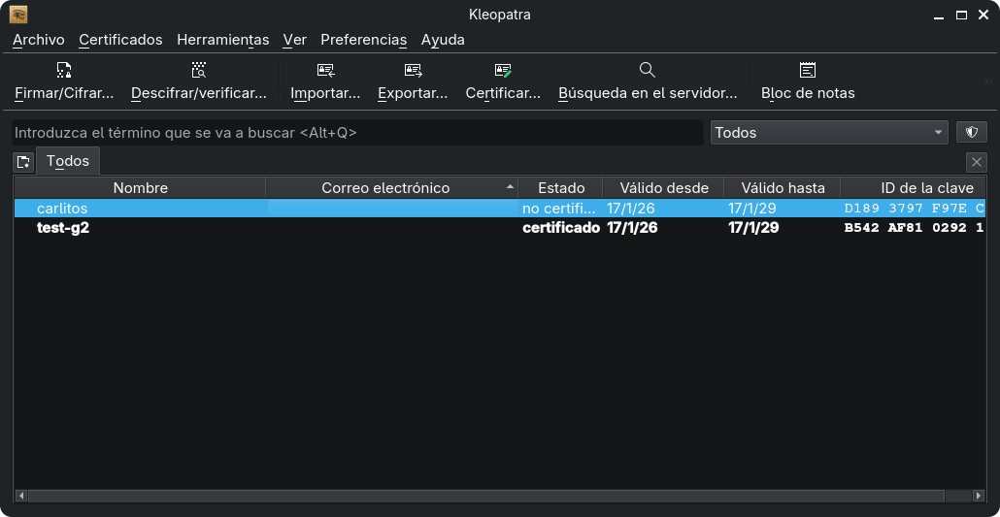
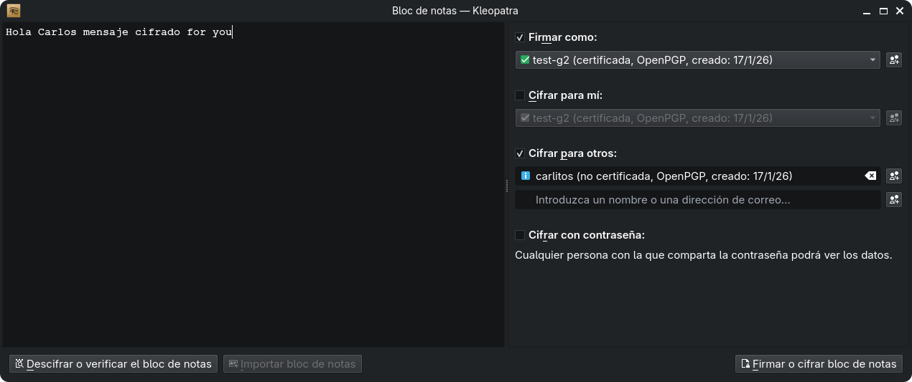
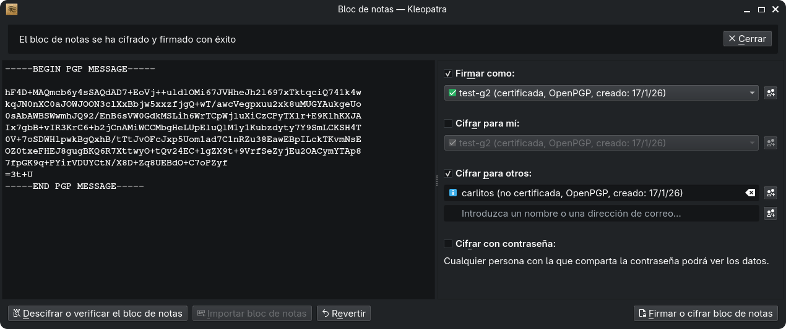
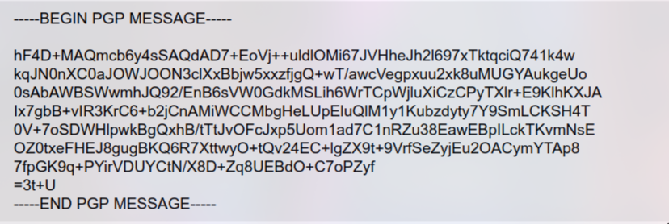
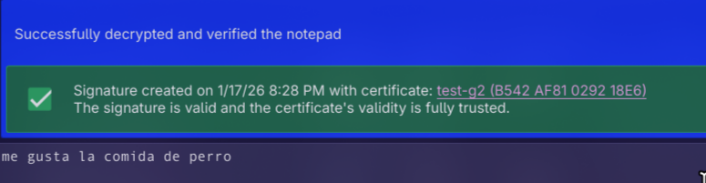

# Chat cifrado con clave asimétrica (Kleopatra + chat web simple)

En esta práctica simulamos un **intercambio de mensajes cifrados** usando criptografía asimétrica (OpenPGP) con **Kleopatra** y un **chat web simple** como canal de transporte.

La idea es:

- El chat (web) solo “transporta” texto.
- El contenido se cifra *antes* de enviarlo.
- Solo el destinatario (con su clave privada) puede descifrarlo.

---

## Requisitos

- Kleopatra instalado (en Windows suele venir con **Gpg4win**; en Linux puede estar como paquete `kleopatra`).
- Dos identidades de prueba (Persona A y Persona B), cada una con su par de claves.
- Un chat web simple (puede ser local o remoto) donde pegar texto.

---

## Flujo de trabajo (paso a paso)

### Paso 1 — Abrimos el chat web (canal de envío)

Usamos el chat web únicamente para **pegar y enviar texto** (no cifra nada por sí mismo).

CAMBIAR IP CAMBIAR IP
CAMBIAR IP
CAMBIAR IP
CAMBIAR IP
CAMBIAR IP
CAMBIAR IP
CAMBIAR IP
CAMBIAR IP

### Paso 2 — Creamos un par de claves en Kleopatra (Persona A)

En Kleopatra generamos un **certificado OpenPGP** (par de claves):

1. Crear nuevo certificado.
2. Elegir OpenPGP.
3. Completar nombre/correo (puede ser de prueba).
4. Elegir una contraseña (passphrase) para proteger la clave privada.

### Paso 3 — Confirmamos que la clave quedó creada

Tras finalizar, Kleopatra muestra el certificado en la lista (ya tenemos clave pública + privada).

### Paso 4 — Exportamos y compartimos la clave pública

Para que la otra persona pueda cifrarnos mensajes, debemos **exportar la clave pública** (no la privada):

- Selecciona tu certificado → Exportar → *clave pública* (normalmente `.asc`).
- Envía esa clave pública por un canal cualquiera (aquí puede ser el chat, correo, etc.).

### Paso 5 — Importamos la clave pública del otro (Persona B)

Cada participante debe tener:

- Su **clave privada** (solo en su equipo).
- La **clave pública del otro** (para cifrarle mensajes).

En este paso se ve la **importación** de la clave pública recibida.

### Paso 6 — Ciframos un mensaje para el destinatario

Para enviar un mensaje seguro:

1. Escribe el texto plano (por ejemplo en un editor).
2. En Kleopatra elige **Cifrar/Encrypt**.
3. Selecciona como destinatario la **clave pública** de la otra persona.
4. (Opcional pero recomendado) marca **Firmar/Sign** para que el receptor pueda verificar que el mensaje realmente es tuyo.

El resultado es un **bloque OpenPGP** (texto cifrado) que se puede copiar.

### Paso 7 — Enviamos el texto cifrado por el chat

Pegamos el bloque cifrado en el chat. Importante:

- El chat verá “basura” (cifrado) y no el contenido real.
- No hay problema si cualquiera intercepta este texto: sin la clave privada no se puede leer.

### Paso 8 — El receptor descifra el mensaje con su clave privada

La Persona B copia el bloque cifrado y en Kleopatra usa **Descifrar/Decrypt**.

- Kleopatra pedirá la passphrase de la clave privada.
- Si además venía firmado, puede mostrar el estado de la firma.

### Paso 9 — Respuesta: repetimos el proceso a la inversa

Para responder, la Persona B cifra (y opcionalmente firma) un nuevo mensaje usando la **clave pública de A**, lo envía por el chat, y A lo descifra con su clave privada.

---

## Buenas prácticas

- **Nunca compartas tu clave privada**: solo se comparte la clave pública.
- Verifica la **huella digital (fingerprint)** de las claves públicas si el contexto lo requiere.
- Si vas a usar “Firmar”, el receptor podrá comprobar autenticidad e integridad.
- Recuerda que el chat sigue revelando **metadatos** (quién habla con quién, cuándo, etc.), aunque el contenido vaya cifrado.